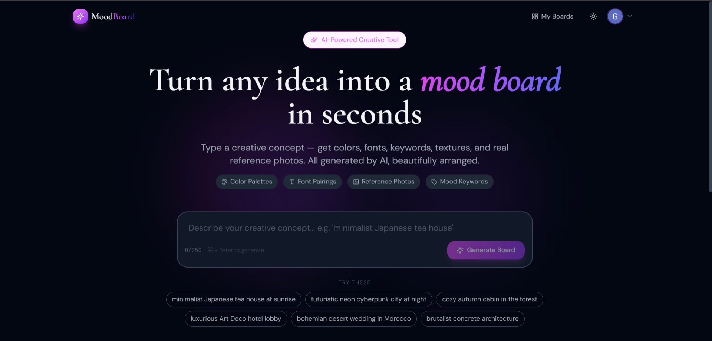
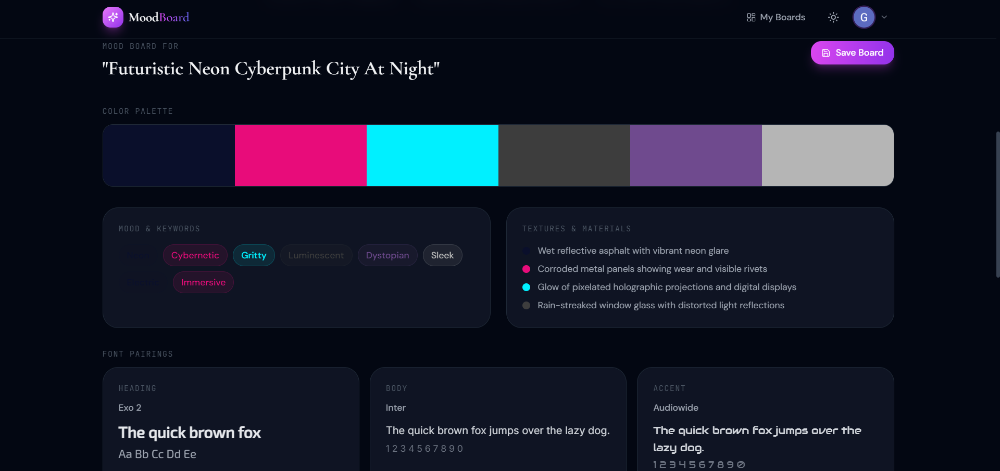
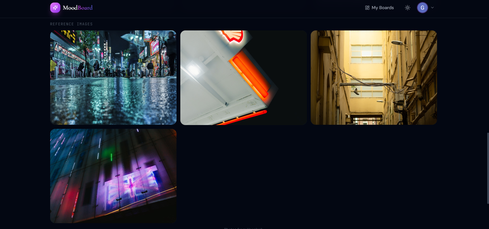

# MoodBoard AI 🎨



MoodBoard AI is a powerful, AI-driven creative application that instantly transforms text concepts into visually stunning, coherent mood boards. Designed for creatives, architects, event planners, and designers, MoodBoard AI accelerates the ideation phase by generating tailored color palettes, typography, conceptual keywords, and real-world reference imagery based on natural language descriptions.

## ✨ Features

- **Semantic to Visual AI Synthesis**: Type any conceptual prompt to generate a highly curated mood board.
- **Dynamic Color Extraction**: Automatically selects harmonious color palettes and gives them descriptive names matching your mood.
- **Smart Typography Pairings**: Suggests highly legible and thematic combinations for headings and body text.
- **Reference Imagery Integration**: Automatically retrieves mood-aligned reference photos using the Unsplash API.
- **High-Performance Architecture**: Built with Next.js 14 App Router for rapid Server-Side Rendering (SSR) and seamless API integration.
- **Dark Mode Support**: Context-aware UI powered by Tailwind CSS that dynamically reacts to system settings.
- **User Authentication**: Secure OAuth workflow utilizing Google Sign-in to protect your generative history.
- **Persistent Storage**: Save your best boards securely to a personalized dashboard backed by MongoDB Atlas.

## 🖼️ Application Previews

**Color Palettes & Mood Keywords**


**Reference Image Generation**


## 🚀 Setup & Installation

### 1. Prerequisites
- Node.js (v18 or higher)
- MongoDB Atlas cluster URL
- Developer accounts for OpenAI, Unsplash, and Google Cloud Console.

### 2. Clone and Install
```bash
git clone https://github.com/your-username/moodboard-ai.git
cd moodboard-ai
npm install
```

### 3. Environment Configuration
Create a `.env.local` file in the root directory and configure it as shown in `.env.local.example`:
```env
OPENAI_API_KEY=your_openai_api_key
UNSPLASH_ACCESS_KEY=your_unsplash_access_key
MONGODB_URI=your_mongodb_connection_string
NEXTAUTH_SECRET=your_nextauth_random_secret
NEXTAUTH_URL=http://localhost:3000
GOOGLE_CLIENT_ID=your_google_oauth_client_id
GOOGLE_CLIENT_SECRET=your_google_oauth_client_secret
```

### 4. Start the Application
Run the local development server:
```bash
npm run dev
```
Navigate to `http://localhost:3000` to interact with the application.

## 💻 Tech Stack
- **Frontend Framework**: Next.js 14
- **Styling**: Tailwind CSS
- **Authentication**: NextAuth.js (OAuth 2.0)
- **Database**: MongoDB & Mongoose *(Note: MongoDB chosen over Firebase for complex nested schema relationships)*
- **Icons**: Lucide React
- **Generative AI Integration**: OpenAI (`gpt-4o-mini`)
- **Image Assets**: Unsplash Image API
